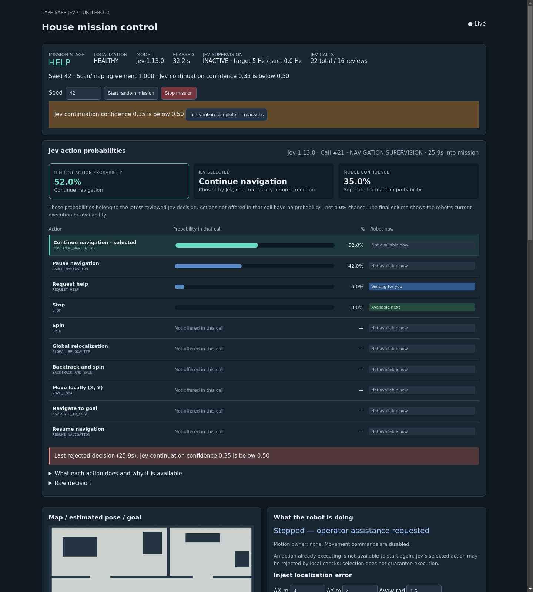

# Random missions with Jev

The mission demo uses ROS 2 Humble, Gazebo Classic, TurtleBot3 Burger, real AMCL,
and Nav2 in `jev-mission` (ROS domain 89). Old recovery containers can remain
stopped. The host ROS installation is unchanged.

## Start and stop

```bash
./scripts/mission_demo.sh
# Without Gazebo/RViz windows:
./scripts/mission_demo.sh --headless
# Start seed 42 immediately:
./scripts/mission_demo.sh --autostart --seed 42
```

Open [the local dashboard](http://localhost:8765). The launcher uses `API_KEY` at
the workspace root, or `TYPESAFE_API_KEY_FILE` / `TYPESAFE_API_KEY`. Credentials
are never included in dashboard events, reports, Git, or Docker build contexts.
The HTTP port is published only on host loopback. Run one mission launch at a time.
Ctrl-C stops a foreground launch. `docker stop jev-mission` stops the container.
The dashboard Stop button revokes velocity ownership immediately and requests
Nav2 cancellation; cancellation must finish before another mission can start.

## Mission sequence

1. Sample a seeded random start, heading, and destination in the largest connected
   component of conservatively inflated known-free map space, at least 3 m apart.
2. Gazebo sets the physical start. AMCL receives global initialization, **not** the
   start pose. The seed reproduces sampling; it does not make AMCL or Jev deterministic.
3. Jev chooses localization actions. Navigation requires stable healthy sensor
   evidence, covariance below 0.35, and scan/map agreement at least 0.85
   (`navigation_min_score`); ground truth is not consulted by this gate.
   Costmaps are refreshed before each navigation start or resumption.
4. Jev starts navigation. Nav2 plans and follows the route, without automatic
   recovery behaviors. Path following uses Nav2 regulated pure pursuit with explicit
   rotation toward the route, collision checking, and a 0.15 m/s speed target.
   The controller monitors localization throughout motion.
5. On localization loss, navigation is cancelled and movement disabled. After
   cancellation, Jev chooses recovery actions and whether to resume the same goal.
6. Arrival is followed by a separate ground-truth evaluation. A healthy AMCL
   estimate alone is not proof of globally correct localization in an ambiguous map.

## Jev actions

| Action | Execution and availability |
| --- | --- |
| SPIN | Odometry-confirmed rotation, finishing early after two seconds of stable localization; safe clearance required |
| GLOBAL_RELOCALIZE | AMCL global reset then rotation; bounded retries |
| BACKTRACK_AND_SPIN | Reverse only over verified recent straight forward history, then rotate |
| MOVE_LOCAL | Turn and drive to an odometry-relative target; X forward, Y left; maximum target distance 0.5 m |
| REPLAN_PATH | Cancel navigation, compute a replacement route without clearing obstacles, then follow the validated route subject to safety clearance |
| CONTINUE_NAVIGATION | Keep the existing Nav2 goal running after a periodic Jev review |
| NAVIGATE_TO_GOAL | Start Nav2 after stable localization |
| PAUSE_NAVIGATION | Remain stopped briefly at a decision point, then reassess |
| RESUME_NAVIGATION | Replan to the same goal after recovery |
| REQUEST_HELP | Stop, display an operator prompt, and wait for acknowledgment |
| STOP | End the mission stopped |

Available choices depend on the mission stage and local safety checks. Initial
AMCL initialization already distributes particles globally, so the first active
localization action is a spin. After a failed spin, global reset or local movement
become available. Jev chooses from the available actions; safety checks may veto
its choice and report why. Safety stops never wait for an API call.

The confidence threshold is **20%** for both the action and the separate local-target
choice. Spin stages in SPIN, GLOBAL_RELOCALIZE, and BACKTRACK_AND_SPIN stop early
after two continuous seconds of fresh, healthy localization with covariance below
0.35 and scan/map agreement at least 0.85. A HEALTHY label alone does not satisfy
this stricter lock. Motion stops immediately, then the normal four-second recovery
evaluation runs before Jev chooses the next action.

The [TypeSafe Choice API](https://docs.typesafe.ai/primitives/choice) is used for
both the action and, when available, a separate local-target choice. The bounded
local targets are `(0.4,0)`, `(0.3,0.3)`, `(0.3,-0.3)`, `(0,0.4)`, `(0,-0.4)`,
and `(-0.4,0)` metres. Blocked paths are removed before the call and checked again
while executing. This is a discrete target vocabulary, not arbitrary real-valued
coordinate generation. Confidence and probabilities remain separate fields.
Rounded probability sums are accepted only within their per-option rounding bound.

Local movement uses fresh odometry and lidar, not AMCL. Robot-relative targets
are frozen at action start. TurtleBot turns and drives rather than moving sideways.
Execution stops on obstacles, stale sensors, odometry jumps, timeout, or excessive
travel. Recovery has a five-action budget and the mission has a ten-minute budget.
Jev errors or low-confidence choices request operator help with motion disabled.

## Inject a localization error

Use the dashboard button, or call the typed ROS service:

```bash
docker exec jev-mission bash -lc \
  'source /opt/ros/humble/setup.bash && source /ws/install_mission/setup.bash && ros2 service call /demo/inject_delocalization jev_demo_interfaces/srv/InjectDelocalization "{dx: 4.0, dy: 4.0, dyaw: 1.5, variance: 0.005}"'
```

The service reports acceptance and a timestamp. It publishes a perturbed AMCL
pose three times for delivery; it does not move the physical robot or directly
trigger recovery. The normal localization monitor must detect the resulting error.
Other controls are Trigger services `/demo/start`, `/demo/stop`, and
`/demo/acknowledge_help`. The dashboard lets you select the next seed.

For help, inspect the robot and obstacles, or provide an approximate initial pose
using RViz's **2D Pose Estimate**, then acknowledge. Acknowledgment grants a fresh
bounded recovery budget, not permission to bypass sensor checks.

## Observe and validate

The dashboard shows the map, estimated pose, goal, planned route, mission stage,
exact credential-free Jev request body, structured response, model, latency,
confidence, probabilities, execution results, and help prompts. The response
contains choices, not an invented model reasoning trace.

ROS telemetry is available on `/demo/state`, `/demo/events`, `/demo/goal`,
`/jev_recovery/state`, and `/jev_recovery/markers`. Navigation commands use
`/navigation/cmd_vel`; recovery commands use `/recovery/cmd_vel`. Only the expiring
mission bridge publishes robot `/cmd_vel`, controlled by `/demo/owner` heartbeats.

```bash
# With the demo idle: run a mission and inject once forward motion is observed.
docker exec jev-mission bash -lc \
  'source /opt/ros/humble/setup.bash && source /ws/install_mission/setup.bash && python3 scripts/check_mission.py --seed 42 --inject'
# Add --observe to follow a mission already started with --autostart.
```

Reports are saved under `docs/mission-runs/`. Mission JSONL contains the timeline;
`.spawn.json` separately records simulation ground truth for reproducibility, never
as Jev input. Check reports record failures as well as successes. The check requires
sensor-triggered navigation cancellation, Jev resumption, arrival, and final position
and localization errors below 0.4 m. Passing seeds are examples, not a reliability
guarantee for every random mission.

Controller reference: [official Humble regulated pure-pursuit documentation](https://github.com/ros-navigation/navigation2/blob/humble/nav2_regulated_pure_pursuit_controller/README.md).

## Ongoing Jev navigation supervision

During `NAVIGATING`, Jev reviews telemetry at a target **5 Hz (every 0.2 seconds)** by default, while
Nav2 continues driving. `jev_supervision_interval` configures this interval (minimum
0.2 seconds). Up to four API requests can be outstanding (`jev_supervision_max_inflight`);
slow calls apply backpressure rather than creating an unbounded backlog. Newer
responses supersede older ones. The target is roughly 300 navigation calls/minute,
plus mission decision calls. Dashboard refreshes do not invoke Jev.

Inputs include estimated pose, measured velocity, Nav2 distance/time feedback and
its age, distance to goal, distance from the planned route, command owner, current
action, and recent samples of scan agreement, uncertainty, clearance and progress.
No simulator ground truth or API key enters these requests. Reviews offer
`CONTINUE_NAVIGATION`, `PAUSE_NAVIGATION`, `REQUEST_HELP`, and `STOP`, plus
`REPLAN_PATH` when localization, sensor evidence, server availability, and attempt budget permit.

Continue preserves the current goal. Pause revokes motion, cancels Nav2, and waits
for cancellation before requesting the next mission decision. Help and stop also
revoke motion. API errors, review timeouts, and low confidence stop and request help.
Local monitoring still runs continuously and can stop for localization loss without
waiting for a review. Replies from a cancelled or superseded goal cannot restart it.

The dashboard shows total Jev calls, supervision-call count, review status, and
interval, observed request rate, in-flight count, all actions and availability,
and the exact reason for a rejected decision. Request/response events identify `NAVIGATION_SUPERVISION` versus
`MISSION_DECISION`; `owner=NAV` can therefore coexist with an active Jev review.


Focused supervision-only verification (start the demo idle first):

```bash
docker exec jev-mission bash -lc \
  'source /opt/ros/humble/setup.bash && source /ws/install_mission/setup.bash && python3 scripts/check_supervision.py'
```

This test explicitly supplies the true pose to AMCL as a **test fixture**, measures
live Jev request frequency while the robot moves, then stops. Production mission
startup still uses unknown-pose global localization. Its report is
`docs/mission-runs/supervision-check.json`.


## Reading the action probability panel

The chart lists all eleven actions, ranks the actions offered in the latest reviewed
call by probability, and highlights the maximum (including ties). Actions absent
from that call are marked **Not offered**, not zero probability. The selected
action and model confidence have separate summary cards. Confidence is not the
selected action's probability.

The **Robot now** column distinguishes an action currently executing from one
available for the next decision. A separate execution panel explains motion
ownership. Historical rejection messages include their mission timestamp. Raw
requests, responses, decisions, and the event timeline remain available below.



The **Jev activity** indicator follows the mission stage: navigation shows its
periodic review rate; recovery shows **Executing Jev decision**; evaluation shows
**Evaluating recovery locally**, with the next request after evaluation. Recovery
execution and evaluation retain continuous local safety/health monitoring without
periodic Jev calls. Waiting, paused, stopped, help, and completed stages each have
an explicit explanation instead of an ambiguous “inactive” label.

## Obstacle safety and simulation tests

`mission_bridge.py` is the sole final velocity publisher. `obstacle_safety.py`
checks a swept circular footprint for the requested and measured motion, and
scales linear and angular speeds together when slowing. Conservative full-scan
validation treats NaN, zero, negative, out-of-range, incomplete, or stale evidence
as a fault. Valid positive infinity represents clear space only to the finite
sensor maximum. Laser points use a scan-time transform into `base_footprint`.

The shared configuration is `config/obstacle_safety.yaml`: radius 0.18 m, margin
0.05 m, braking assumption 0.3 m/s², reaction allowance 0.15 s plus scan age,
slowdown band 0.25 m, sensor timeout 0.5 s, and release delay 1 s. The stopping
sweep conservatively retains constant velocity for the full braking interval.
These values require separate measurement and validation before hardware use.

`/demo/safety` reports status, reason, envelope clearance, scan/odometry age,
requested/applied velocity, owner, and latch state. Status changes appear as
SAFETY events. `SAFETY_WAIT` permits one Jev assessment for replanning or waiting when localization and sensors are reliable. It does not run periodic reviews; after 15 s,
the mission requests help. Old commands are flushed, outstanding navigation
reviews are invalidated, and navigation cancellation must complete before Jev
reassesses. Existing recovery clearance checks still apply. Faults cannot be
cleared by model confidence or an operator acknowledgment alone.

Insert a test-owned 0.2 × 0.2 × 0.5 m static box ahead of the robot, only where
fresh forward scan evidence shows sufficient clearance:

```bash
docker exec jev-mission bash -lc \
  'source /opt/ros/humble/setup.bash && source /ws/install_mission/setup.bash && python3 scripts/obstacle_fixture.py insert --distance 0.65'

docker exec jev-mission bash -lc \
  'source /opt/ros/humble/setup.bash && source /ws/install_mission/setup.bash && python3 scripts/obstacle_fixture.py remove'
```

This helper changes Gazebo geometry, not the AMCL pose. It only removes its named
`jev_safety_test_obstacle`; existing objects are not deleted. Nav2 may avoid a box
placed far enough away without the final gate needing to stop the robot.

For an automated check, start the demo idle and run:

```bash
docker exec jev-mission bash -lc \
  'source /opt/ros/humble/setup.bash && source /ws/install_mission/setup.bash && python3 scripts/check_obstacle_safety.py'
```

This uses an explicit known-pose AMCL fixture, real Jev navigation, and a box
inserted 0.4 m ahead while moving. It checks a BLOCKED state, revoked ownership,
zero commands, positive sampled geometric clearance, and at most one new Jev assessment during
the blocked wait. Finally it stops the mission and removes its obstacle. The report
is `docs/mission-runs/obstacle-check.json`. The fixture does not prove arbitrary
moving-obstacle avoidance or unknown-pose localization, and uses geometric
separation rather than a Gazebo contact sensor.

## Jev-controlled route replanning

`REPLAN_PATH` is offered during navigation or after an obstacle stop when
localization is ready, safety telemetry is fresh, and the planner/controller are
available. It shares the 20% confidence threshold and has a limit of two attempts
per mission. Sensor faults do not permit replanning. A blocked episode permits
one assessment after cancellation; choosing pause returns to waiting without
periodic requests. Obstacles alone do not call for global AMCL initialization.

The robot first revokes ownership and cancels its active goal. Nav2's
`ComputePathToPose` then plans while stationary using current costmaps. This action
never clears obstacle observations. The response must succeed, contain a finite,
continuous map-frame route, start near the estimate, and end near the original
goal. Planning times out after eight seconds. Invalid/no-path results request help.

A valid route does not enable motion. The bridge may discard the previous blocked
trajectory only while the owner is NONE and measured motion is near zero. It
still requires valid sensors, footprint clearance, and sustained-clearance delay.
Every new command is checked against its own stopping envelope. Safe departure
must be available within five seconds; otherwise the mission requests help.
`FollowPath` executes the exact validated replacement route, with Jev supervision.

The navigation behavior trees now compute once per goal instead of automatically
replanning every second. `RESUME_NAVIGATION` remains a restart after interruption;
`REPLAN_PATH` is an explicit route-replacement decision with its own attempt budget.
The dashboard shows its probability when offered, attempt count, result, and route.
