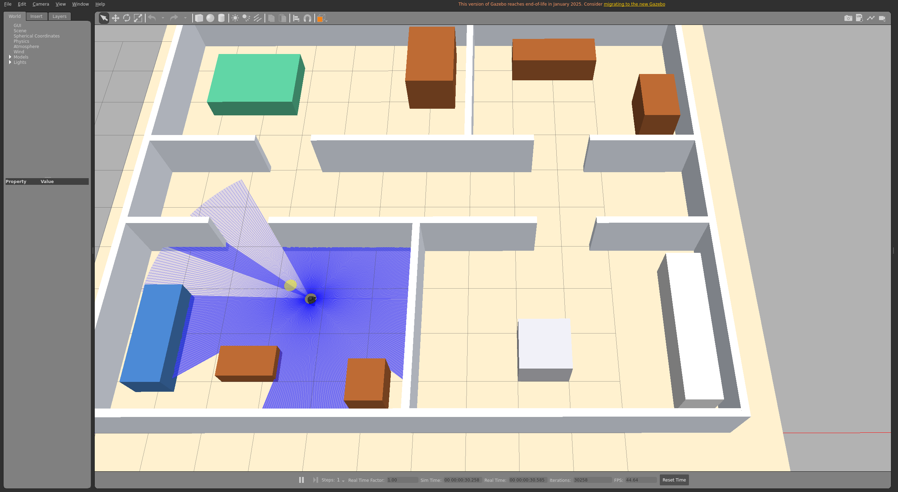
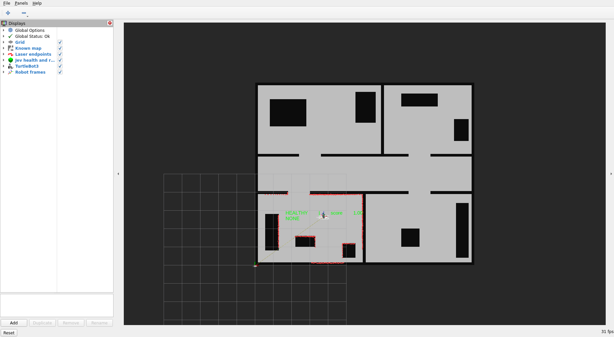

# Recovery-only demos and standalone integration

For the current random-mission demo, start with the [README](../README.md).
These instructions cover the earlier recovery-only tools and standalone node.

## Gazebo + TurtleBot3 house demo

The recovery-only visual demo runs **Gazebo Classic 11.10.2, ROS 2 Humble, TurtleBot3
Burger, and real Nav2 AMCL** in the isolated container `jev-gazebo` (ROS domain 88).
The host's ROS installation is unchanged. Gazebo and RViz use your Ubuntu X11 desktop.

```bash
# From this workspace: builds the image/package as needed, then opens both windows.
./scripts/gazebo_house.sh

# Alternative: same simulator and localization, without desktop windows.
./scripts/gazebo_house.sh --headless

# Real TypeSafe Jev decisions, reading the raw key from ./API_KEY.
./scripts/gazebo_house.sh --jev
```

Only run one instance. The desktop needs `DISPLAY` and a readable `XAUTHORITY`;
the script mounts the X socket and your existing authentication file read-only,
without changing X server access permissions. Software rendering is enabled for
portability. Ctrl-C stops the foreground launch. If the demo is already running
from this development session, stop it with `docker stop jev-gazebo` before relaunching.

The **custom Jev house** is 12 × 10 m with a living room, kitchen, bedroom, office,
hallway, doorways, and simple furniture. It is not ROBOTIS's downloadable house
asset. [generate_house.py](../scripts/generate_house.py) creates both the Gazebo SDF
and the 0.05 m occupancy map from the same geometry. Regenerate with
`python3 scripts/generate_house.py` after editing the layout. The official robot
assets are loaded from the installed `turtlebot3_gazebo` package.

After HEALTHY appears, inject a large localization error in another terminal:

```bash
docker exec jev-gazebo bash -lc \
  'source /opt/ros/humble/setup.bash && source /ws/install_gazebo/setup.bash && ros2 run jev_localization_recovery inject_delocalization --dx 4 --dy 4 --dyaw 1.5 --variance 0.005 --ros-args -p use_sim_time:=true'
```

The robot stays physically in place during injection, then rotates during recovery.
Watch Gazebo for physical motion and RViz for scan/map alignment and the colored
health/action label. A latched STOP can be reset through `/jev_recovery/reset_stop`.

For the automated end-to-end check, with the demo running:

```bash
docker exec jev-gazebo bash -lc \
  'source /opt/ros/humble/setup.bash && source /ws/install_gazebo/setup.bash && python3 scripts/check_gazebo_recovery.py'
```

This checks real commands and odometry, a nearly complete rotation, no substantial
translation, and a `GLOBAL_RELOCALIZE` success event. The test writes its measured
metrics to `docs/gazebo-validation.json`. AMCL convergence remains probabilistic.

Gazebo publishes `/scan`, `/odom`, `/clock`, and `odom → base_footprint`; AMCL serves
`/reinitialize_global_localization` (`std_srvs/srv/Empty`). Recovery uses the exclusive
`/recovery/cmd_vel` topic, relayed to the robot's `/cmd_vel` with a 0.4-second command
expiry. Demo support requests AMCL no-motion updates once per simulated second.
The Nav2 localization components are running; autonomous goal navigation is not launched.

Launch definition: [gazebo_house.launch.py](../src/jev_localization_recovery/launch/gazebo_house.launch.py).
AMCL tuning: [house_amcl.yaml](../src/jev_localization_recovery/config/house_amcl.yaml).
Build outputs are separate (`build_gazebo`, `install_gazebo`, `log_gazebo`).



## Headless demo on this machine

This project includes a small differential-drive simulator with an asymmetric map,
360-degree raycast laser, wheel-style odometry, TF, collision checks, and a command
watchdog. Localization is provided by the **real Nav2 AMCL executable**. It uses wall
time and needs no Gazebo or graphics installation. It is a kinematic demo rather
than a physics simulation. The full Nav2 planner/controller stack is not launched.

Use three terminals from this workspace:

```bash
# Terminal 1: simulator + real AMCL (only run one instance).
docker exec -it jev-recovery-test bash /ws/scripts/run_amcl_demo.sh

# Terminal 2: recovery node.
docker exec -it jev-recovery-test bash -lc \
  'source /opt/ros/humble/setup.bash && source /ws/install/setup.bash && ros2 launch jev_localization_recovery jev_recovery.launch.py use_sim_time:=false enable_recovery:=true'

# Terminal 3, after HEALTHY: corrupt the estimate, leaving robot position unchanged.
docker exec -it jev-recovery-test bash -lc \
  'source /opt/ros/humble/setup.bash && source /ws/install/setup.bash && ros2 run jev_localization_recovery inject_delocalization --dx 7.8 --dy 1.5 --dyaw 1.0 --variance 0.005'
```

Bringup logs are inside the container at `/tmp/jev-amcl-demo/`. Ctrl-C in terminal 1
stops its simulator, AMCL, and lifecycle manager. The simulator asks AMCL for
no-motion updates every 0.5 seconds to maintain fresh poses despite perfect,
stationary odometry. AMCL particle convergence is probabilistic; failed recovery
remains visible and bounded by the attempt limit.

## Visualization

Terminal logs are available immediately. For RViz2 on a compatible ROS desktop,
use the supplied [demo.rviz](../src/jev_localization_recovery/config/demo.rviz) preset:

```bash
rviz2 -d "$(ros2 pkg prefix jev_localization_recovery)/share/jev_localization_recovery/config/demo.rviz"
```

It shows the map, laser endpoints, robot model/TF frames, and a colored text marker with
HEALTHY/DEGRADED/LOST, score, and current recovery action. RViz must share the
simulator's ROS domain/network. The `gazebo-humble` image includes and launches RViz;
the original `test-humble` image is headless and does not include RViz.



## Build and monitor

With a complete ROS 2 installation and dependencies from `package.xml` installed:

```bash
source /opt/ros/humble/setup.bash
colcon build --symlink-install --packages-select jev_localization_recovery
source install/setup.bash
ros2 launch jev_localization_recovery jev_recovery.launch.py
```

The launch file defaults to `use_sim_time:=true` and `enable_recovery:=false`.
For a robot or publisher without `/clock`, add `use_sim_time:=false`.
Launch your simulator and localization stack first, including a known map,
initialized AMCL, LaserScan, odometry, and TF from odom → base → laser.
The node prints each discovered topic and publishes readable health logs,
JSON on `/jev_recovery/state`, and text markers on `/jev_recovery/markers`.
Add an RViz Marker display and set its fixed frame to the map's frame.

## Run recovery and inject an error

First confirm the monitor reports HEALTHY. Enable autonomous recovery explicitly:

```bash
ros2 launch jev_localization_recovery jev_recovery.launch.py enable_recovery:=true
```

In a second sourced terminal, corrupt only AMCL's belief:

```bash
# Small perturbation: adjust for your map/cell tolerance.
ros2 run jev_localization_recovery inject_delocalization --dx 0.3 --dy 0.2 --dyaw 0.2
# Large perturbation.
ros2 run jev_localization_recovery inject_delocalization --dx 3.0 --dy -2.0 --dyaw 1.5
```

For a wall-clock simulator/robot add `use_sim_time:=false` to launch. For injection
in a simulator with `/clock`, append `--ros-args -p use_sim_time:=true`.
The injector discovers `/amcl_pose` and `/initialpose` by type and recognizable
basename; use `--pose-topic` and `--initialpose-topic` when multiple robots exist.
Offsets are relative to the latest AMCL estimate. It never teleports the robot.

Watch the decision probabilities and `RECOVERY SUCCESS` / `RECOVERY FAILED` logs.
The same events are JSON messages on `/jev_recovery/events`. A successful service
call or completed rotation alone does not mean localization recovered.

STOP remains latched and publishes zero commands until you inspect conditions and reset:

```bash
ros2 service call /jev_recovery/reset_stop std_srvs/srv/Trigger '{}'
```

Reset clears the attempt counters and resumes monitoring after a cooldown.

## Motion prerequisites

- Full 360-degree laser coverage, fresh laser TF and odometry are required for
  recovery motion. Missing/invalid sectors fail closed. `+inf` means no return up
  to a finite sensor maximum; NaN/zero/negative readings mean unavailable clearance.
- `spin_clearance` and `rear_clearance` are distances from the base origin, so set
  them to include your robot's footprint radius plus a margin.
- The node discovers `Twist` or `TwistStamped` from the actual velocity topic.
  It refuses motion if another publisher shares that topic or no controller subscribes.
  For this demo, run AMCL/map/robot sensing with navigation command publishers stopped,
  or configure an exclusive recovery input on a velocity multiplexer with the appropriate
  priority/lock. Do not run teleop simultaneously. An idle Nav2 publisher still counts.
- Rotations use odometry yaw, not elapsed time or the potentially corrupted global pose.
  Motion and service calls time out. Safety is rechecked every 100 ms using a steady
  wall clock, even if ROS simulated time pauses.
- Backtracking requires at least `backtrack_distance` (default 0.6 m) of recent,
  approximately straight forward odometry history and safe rear laser coverage.
  Curved, discontinuous, stale, or unavailable history disables that option. It
  reverses slowly along that segment, stops if it deviates, and then spins. It does
  not retrace arbitrary navigation paths or use AMCL as its motion reference.
- The base controller must have its own command timeout/watchdog for a killed process
  or broken transport. In-process stop commands cannot cover those failures.

## Real TypeSafe Jev integration

Start with `./scripts/gazebo_house.sh --jev` (add `--headless` if needed).
The default key file is `API_KEY` at the workspace root. Alternatively use
`--key-file /absolute/workspace/path` or export `TYPESAFE_API_KEY` in your shell.
`TYPESAFE_API_KEY_FILE` is also supported. Files must contain just the raw key;
the launcher maps workspace file paths into Docker. Credential files are excluded
from Git and the Docker build context. Restart the launch after changing the key.

The adapter uses the documented [TypeSafe Choice API](https://docs.typesafe.ai/primitives/choice)
at `https://api.typesafe.ai/v1/systemone`, requesting `jev-latest` by default.
It sends compact localization state, capabilities, clearances, and attempt counts;
it does not upload raw scans or the map. No additional Python SDK is required.
The returned model, action, confidence, and four probabilities appear in
`/jev_recovery/state` and `/jev_recovery/events`.

Requests run outside the ROS callback thread, with zero velocity while waiting.
The node rechecks sensor freshness and decision relevance before acting. API errors,
invalid responses, decision timeouts, and confidence below `jev_min_confidence`
(default 0.2, or 20%) latch STOP. Local clearance and attempt limits still govern motion.
There is no automatic fallback to mock decisions. Without `--jev`, the provider
defaults to the offline mock policy.

With Jev running, verify the complete recovery with:

```bash
docker exec jev-gazebo bash -lc \
  'source /opt/ros/humble/setup.bash && source /ws/install_gazebo/setup.bash && python3 scripts/check_gazebo_recovery.py --provider jev'
```

This makes a live API request and writes `docs/jev-gazebo-validation.json` on success.
Tune `jev_model`, `jev_timeout`, `decision_timeout`, and `jev_min_confidence` in
the recovery YAML before relaunching. Direct ROS launches accept `selector_provider:=jev`
and read credentials from the node's environment or `jev_api_key_file` parameter.

## Code and Jev boundary

| Module | Responsibility |
| --- | --- |
| `localization_monitor.py` | Pose uncertainty, recent jumps, health classification, structured state |
| `scan_map_score.py` | Endpoint projection, grid lookup, laser clearance |
| `recovery_selector.py` | Exactly four actions, validated probabilities, mock policy, real Jev HTTP adapter |
| `recovery_actions.py` | Nonblocking motion and service execution with independent safety checks |
| `recovery_node.py` | ROS discovery, TF, state machine, evaluation, logs and markers |
| `inject_delocalization.py` | Relative pose perturbation through AMCL's input |

`RecoverySelector.choose(LocalizationState)` returns `RecoveryDecision` with
`selected_action`, `confidence`, four action probabilities, an explanation, and model.
`LocalizationState.to_dict()` supplies the structured input for the Jev adapter.
Confidence and the selected action's probability are preserved as separate values.

The sequence is `MONITORING → LOCALIZATION_BAD → SELECT_RECOVERY → EXECUTING_RECOVERY
→ EVALUATING`, returning to monitoring on success or retrying within the configured
attempt limit. Unknown evidence cannot start a recovery; missing safety evidence
during recovery latches STOP. Malformed provider output also latches STOP.
With Jev, `WAITING_DECISION` occurs between selection and execution.

Empty topic names in [recovery_params.yaml](../src/jev_localization_recovery/config/recovery_params.yaml)
mean discovery by actual graph type and basename. Ambiguous graphs require explicit
fully qualified names in the YAML. `base_frame` and `odom_frame` must match your
robot's TF tree (some TurtleBots use `base_footprint`). Parameters are read at startup;
edit YAML and relaunch to tune. A custom file can be passed as `params_file:=/path/config.yaml`.

## Isolated runtime on this machine

The already-created container is `jev-recovery-test`, mounted at `/ws`:

```bash
docker exec -it jev-recovery-test bash
source /opt/ros/humble/setup.bash
cd /ws
colcon build --symlink-install --packages-select jev_localization_recovery
source install/setup.bash
colcon test --packages-select jev_localization_recovery --event-handlers console_direct+
colcon test-result --verbose
```

To reproduce the container on another machine:

```bash
docker build -f docker/test-humble.Dockerfile -t jev-recovery:humble .
docker run -d --name jev-recovery-test -e ROS_DOMAIN_ID=87 \
  -v "$PWD:/ws" -w /ws jev-recovery:humble
```

This container's ROS domain/network is intentionally separate from a live robot.
Run the simulator and demo in the same container for local testing.

## Tests without ROS

```bash
PYTHONPATH=src/jev_localization_recovery python3 -m pytest -q src/jev_localization_recovery/test
```

The scoring and monitoring modules have no ROS dependency. ROS integration tests
skip when `rclpy` is unavailable. They use actual ROS messages when run in Humble.

With the headless simulator/AMCL running and no separately launched recovery node,
the opt-in AMCL integration checks start their own monitor and issue real recovery motion:

```bash
docker exec jev-recovery-test bash -lc \
  'source /opt/ros/humble/setup.bash && source /ws/install/setup.bash && JEV_RUN_AMCL_DEMO=1 python3 -m pytest -q -s src/jev_localization_recovery/test/test_amcl_demo.py'
```

## Limits to understand during the demo

- The score measures hit endpoints near occupied cells, not ray free-space consistency.
  Symmetric rooms, dynamic obstacles, and an incorrect map can confuse it.
- Unknown map cells and invalid/no-return endpoints cannot produce a fake healthy score.
  Endpoints outside the map count as disagreements.
- Laser extrinsics, map-origin yaw, and scan-time odometry propagation are respected.
  A newest odometry transform may substitute for the scan-time transform within
  `tf_time_tolerance` (default 0.05 seconds), accommodating asynchronous Gazebo messages.
  Larger gaps, missing TF, stale timestamps, or too few beams produce UNKNOWN evidence.
- AMCL can keep its pose unchanged while stationary. The default pose timeout is
  30 seconds; tune `max_pose_age` for your AMCL publication behavior.
- This is a small demonstration, not a navigation safety controller.
